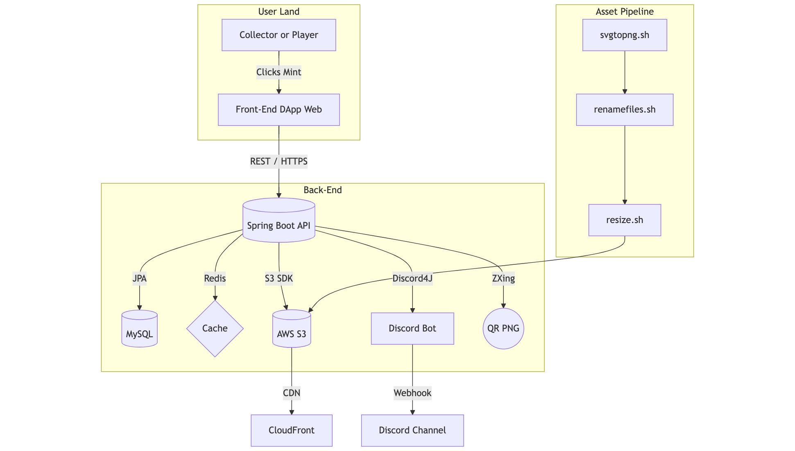

<h1 align="center">⚔️ Warrior Town</h1>
<p align="center">
  A modern Java-based backend framework to manage digital warriors with automation and precision.<br/>
  Built with Maven. Scripted in Bash. Fueled by Code. 🛠️
</p>

<p align="center">
  
  
  
  <a href="https://opensea.io/collection/warrior-town" target="_blank">
    
  </a>
</p>

---

## 📑 Table of Contents
1. [Introduction](#-introduction)
2. [Key Features](#-key-features)
3. [Architecture](#-architecture)
4. [Getting Started](#-getting-started)
5. [Script Tooling](#-script-tooling)
6. [API Reference](#-api-reference)
7. [Discord Bot](#-discord-bot)
8. [Deployment](#-deployment)
9. [Roadmap](#-roadmap)
10. [Contributing](#-contributing)
11. [License](#-license)
12. [Acknowledgements](#-acknowledgements)

---

## 🔰 Introduction
**Warrior Town** is a full-stack platform for creating and launching generative NFTs. It automates the heavy-lifting—SVG → PNG/JPG conversion, image optimisation, metadata generation, CDN upload, REST APIs, and live Discord notifications—so that you can focus on world-building and community.

*Tech stack:* **Spring Boot 2.4**, **MySQL 8**, **Redis (Opt.)**, **AWS S3 + CloudFront**, **Discord4J/Javacord**, **Swagger UI 3**, **ImageMagick + Inkscape**.

---

<p align="center">
  
</p>

---

## 🗡️ Key Features
- **Layered Asset Pipeline** – Shell scripts (`svgtopng.sh`, `resize.sh`, `renamefiles.sh`) batch-convert SVGs to optimised PNG/JPG, trim whitespace, and prepare separate outputs for OpenSea & S3.
- **Mint-Ready Metadata** – `/api/v1/warriors` exposes ERC-721 compatible JSON including trait details & CDN image links.
- **RESTful Backend** – Spring Boot API with global exception handling, request interception, and Swagger docs.
- **Authentication & Rate-Limiting** – JWT-based login plus optional Redis cache to throttle abusive requests.
- **Discord Integration** – Real-time mint alerts, rarity reveals, and server command hooks via Javacord / Discord4J.
- **QR Code Utility** – Fast ZXing service to embed scannable codes in marketing creatives.
- **Cloud Deployments** – AWS S3 upload, CloudFront CDN invalidation, and Dockerised builds for Fargate / ECS.

---

## 🏗️ Architecture

<p align="center">
  
</p>


## 🚀 Getting Started

### Prerequisites

- Java 17 or newer
- Maven 3.9+
- MySQL 8.x (or MariaDB)
- Redis (optional for cache / rate limiting)
- AWS account with an S3 bucket (optional, for production uploads)
- ImageMagick & Inkscape CLI tools (for asset scripts)

### Build & Run

```
# Clone the mono‑repo
$ git clone https://github.com/yashjani/warrior.town.git
$ cd warrior.town/thewarriors

# Run tests & start the API
$ ./mvnw spring-boot:run
```
## Environment Variables

| Variable                            | Description                                  |
| ----------------------------------- | -------------------------------------------- |
| `DB_URL`                            | JDBC URL for MySQL                           |
| `DB_USER` / `DB_PASS`               | Database credentials                         |
| `JWT_SECRET`                        | Secret key for signing tokens                |
| `AWS_ACCESS_KEY` / `AWS_SECRET_KEY` | S3 upload credentials                        |
| `DISCORD_TOKEN`                     | Discord bot token                            |
| `CF_DISTRIBUTION_ID`                | CloudFront distribution ID (for cache purge) |

## 🛠️ Script Tooling
| Script                                 | Purpose                                                                        |
| -------------------------------------- | ------------------------------------------------------------------------------ |
| `svgtopng.sh <collectionDir> <season>` | Convert all SVG layers to trimmed PNG/JPG, output to *opensea* & *aws* folders |
| `renamefiles.sh <imageDir>`            | Compress & rename PNG → JPG for faster on-chain minting                        |
| `resize.sh <imageDir>`                 | Uniformly resize all JPGs to 800×800 px                                        |
All scripts rely on ImageMagick and log to stdout for simple CI integration.

## 📡 API Reference (v1)
| Method | Endpoint                | Description                   |
| ------ | ----------------------- | ----------------------------- |
| `GET`  | `/api/v1/warriors`      | List full collection metadata |
| `GET`  | `/api/v1/warriors/{id}` | Fetch single warrior JSON     |
| `POST` | `/api/v1/auth/login`    | Obtain JWT token              |
| `POST` | `/api/v1/auth/register` | Create user account           |
| `POST` | `/api/v1/qr`            | Generate on-demand QR PNG     |

## 💬 Discord Bot
1. Create an application on the Discord Developer Portal and copy the bot token.
2. Add the token to .env → DISCORD_TOKEN.
3. Invite the bot to your server with bot & webhook.incoming scopes.
4. On mint events, the API posts rich embeds to #mint‑feed:

    4.1 Thumbnail of the newly‑minted warrior
    
    4.2 Rarity score and on‑chain tx link

## ☸️ Deployment
```
# Build JAR
./mvnw clean package -DskipTests

# Run inside Docker
docker build -t warrior-town .
docker run -d -p 8080:8080 --env-file .env warrior-town
```
For prod, deploy the container to AWS ECS/Fargate, GCP Cloud Run, or Kubernetes. A ready-made GitHub Action (aws-deploy.yml) handles CI/CD.

## 🗺️ Roadmap
- On-chain mint & reveal contract (Solidity + Hardhat)
- Next.js front-end portal with wallet connect
- Trait-rarity analytics & leaderboard
- Multi-language support (i18n)

## 🤝 Contributing
- PRs welcome—please open an issue first for major changes.
- Fork the repo & create your branch feature/awesome
- Commit with conventional messages
- Run ./mvnw test and ensure checks pass
- Open a PR explaining why rather than what


## ⚖️ License & Acknowledgements

Licensed under the **MIT License** – see [`LICENSE`](LICENSE).

> Built with ❤ by [@yashjani](https://github.com/yashjani) & community.

Special thanks to Spring Boot, ImageMagick, Inkscape, Discord4J, ZXing, AWS S3

### ✨ “Every warrior needs a base—make this one yours.”
